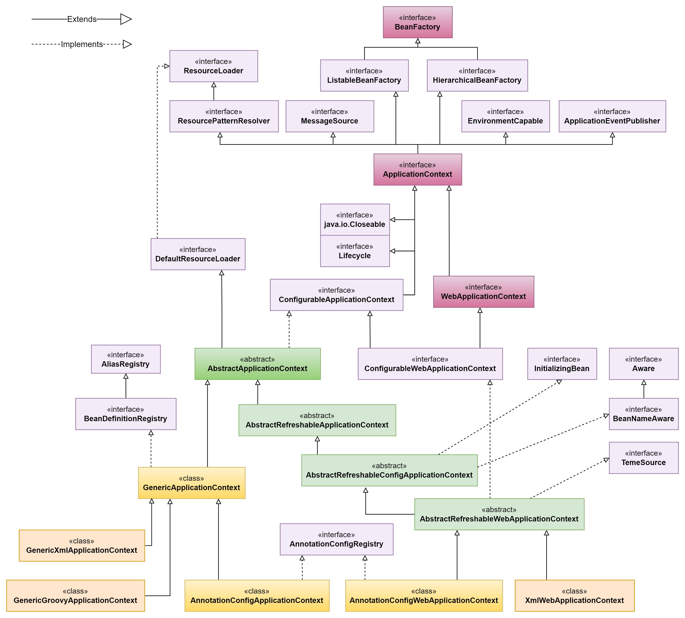

# ✍️toby_spring study ✍

토비의 스프링 책을 따라가며 Spring Framework에 대해 학습했습니다.

내용이 길고,난이도가 꽤 있는 편이지만 제대로 된 기본기를 탄탄하게 익히고,개념을 탄탄하게 익힐 수 있을 듯해 이 책을 공부하고 정리하기로 결정했습니다.

Maven 환경으로 변경하였고, 10년도 넘은 너무 오래된 구버전이기에 2023년 시점에 맞는 환경을 구성하여 학습했습니다.

  

-  **블로그** : [쿠릉쿠쿠의 기술블로그](https://chlee12.tistory.com/56)
  

- **Spring IoC Container(6.0.10 API)**
  

### ⚙️개발환경

-  **IDE : IntelliJ IDEA 2023.2.1**

-  **SpringFramework : 5.3.20**

-  **Java : 11**

-  **Maven**

-  **Dependency**
  -  **MariaDB**
  -  **Spring Framework: DAO**
  -  **Spring test**
  - **JUnit5**
  - **Mockito**
  - **OXM**
  - **H2**
  - **Java Mail**